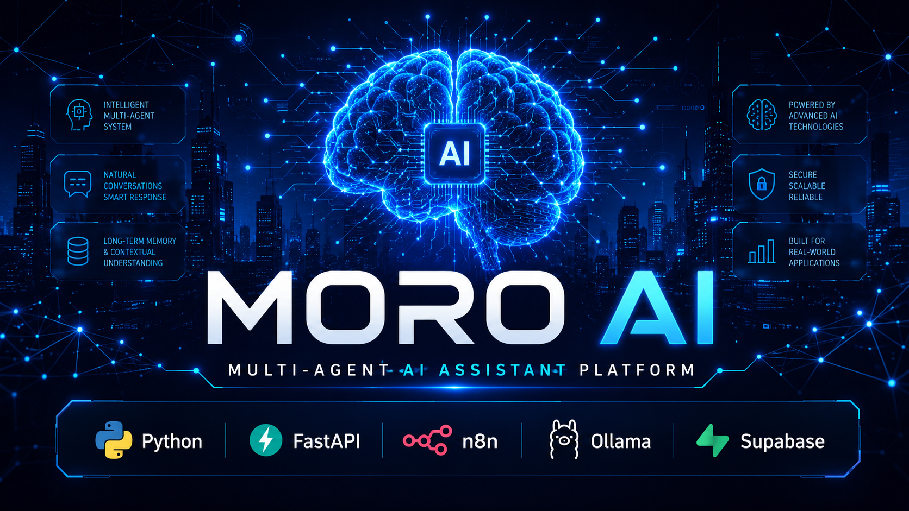

<p align="center">
  
</p>


# 🤖 MORO AI


## 🚀 Overview

MORO AI is a modular AI assistant backend built using FastAPI, n8n, Ollama, and Supabase.

It follows a multi-agent architecture where specialized AI agents collaborate to provide intelligent responses, memory management, career guidance, gratitude journaling, and future AI services.

Designed with scalability in mind, MORO acts as the foundation for a production-ready AI assistant platform.

---

# 🚀 Features

- 🧠 Multi-Agent Architecture
- ⚡ FastAPI REST API
- 🔀 Intelligent Request Routing
- 💾 Long-Term Memory using Supabase
- 🤖 Local LLM Integration (Ollama)
- 🔄 Modular n8n Workflows
- 📚 Career Guidance Agent
- 🙏 Gratitude Journal Agent
- 🎮 Game Recommendation Agent
- 🧠 Memory Recall Agent
- 📡 API Gateway

---

# 🏗️ Tech Stack

Backend
- FastAPI
- Python

Automation
- n8n

AI
- Ollama
- Gemma / Qwen Models

Database
- Supabase

Version Control
- Git
- GitHub

---

# 📂 Project Structure

```
Moro_backened
│
├── app/
│   ├── main.py
│
├── WORKFLOWS/
│   ├── API_GATEWAY.json
│   ├── ORCHESTRATOR_V1.json
│   ├── MASTER_ROUTER_V1.json
│   ├── MEMORY_AGENT_V1.json
│   ├── RECALL_AGENT_V1.json
│   ├── CAREER_AGENT_V1.json
│   ├── GRATITUDE_AGENT_V1.json
│   ├── GAME_AGENT_V1.json
│   └── UNIFIED_CHAT_AGENT_V1.json
│
├── requirements.txt
├── README.md
└── .gitignore
```

---

# ⚙️ Installation

Clone the repository

```bash
git clone https://github.com/utkarshsd/MORO_BACKEND.git
```

Go into the project

```bash
cd MORO_BACKEND
```

Create virtual environment

```bash
python -m venv venv
```

Activate virtual environment

Windows

```bash
venv\Scripts\activate
```

Install dependencies

```bash
pip install -r requirements.txt
```

Run FastAPI

```bash
uvicorn app.main:app --reload
```

---

# 📡 API Endpoint

POST

```
/chat
```

Example

```json
{
  "user_id":"123",
  "user_message":"Help me build my portfolio"
}
```

---

# 🧠 Current Agents

✅ API Gateway

✅ Orchestrator

✅ Master Router

✅ Career Agent

✅ Gratitude Agent

✅ Game Agent

✅ Memory Agent

✅ Recall Agent

---

# 📈 Roadmap

- User Authentication
- Voice Conversations
- WhatsApp Integration
- Emotion Detection
- React Frontend
- Docker Deployment
- Cloud Deployment
- Analytics Dashboard

---

# 👨‍💻 Author

Utkarsh Pandey

B.Tech CSE (AI & ML)

Building AI products using Python, FastAPI, n8n and LLMs.

GitHub

https://github.com/utkarshsd
